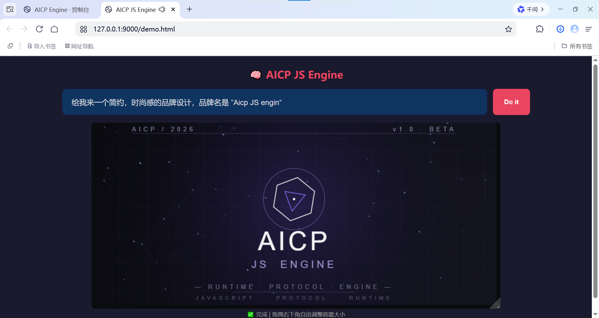
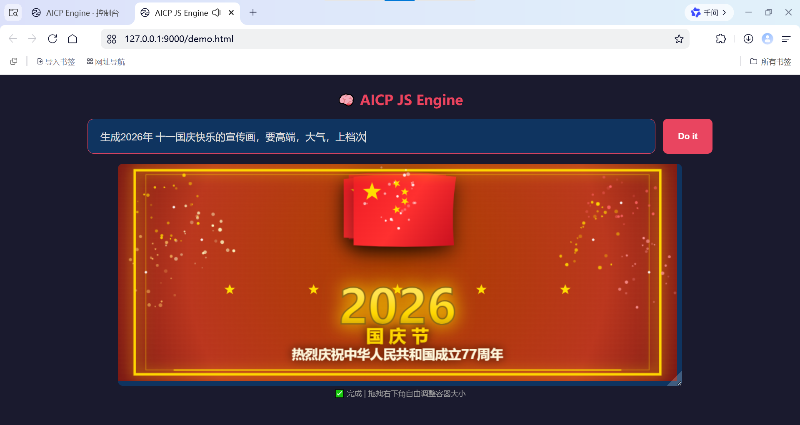
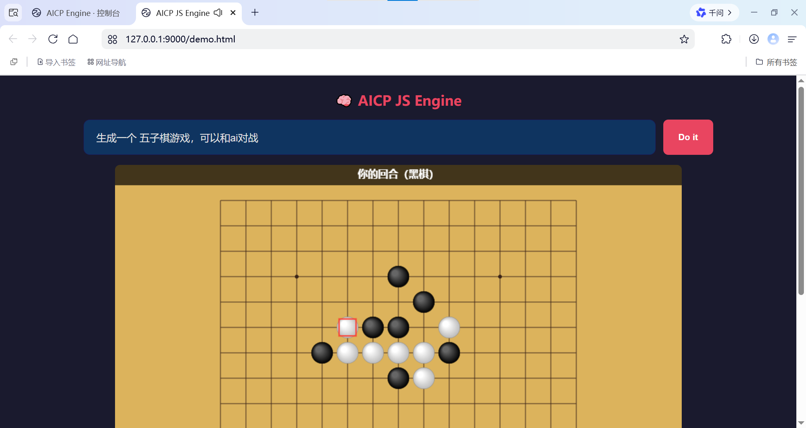
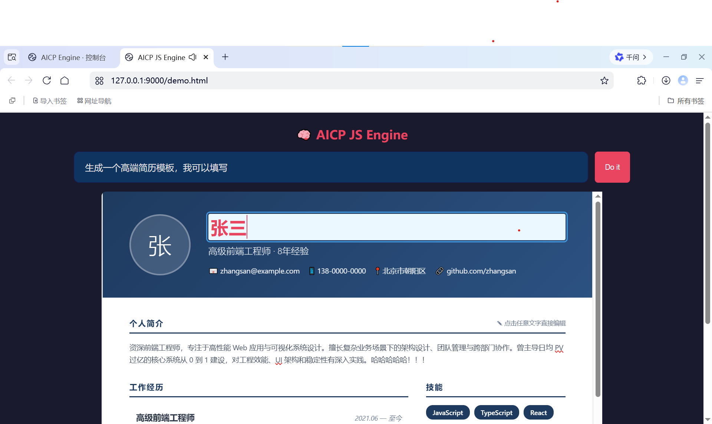
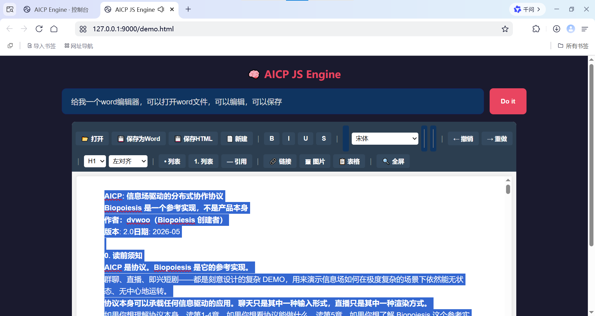
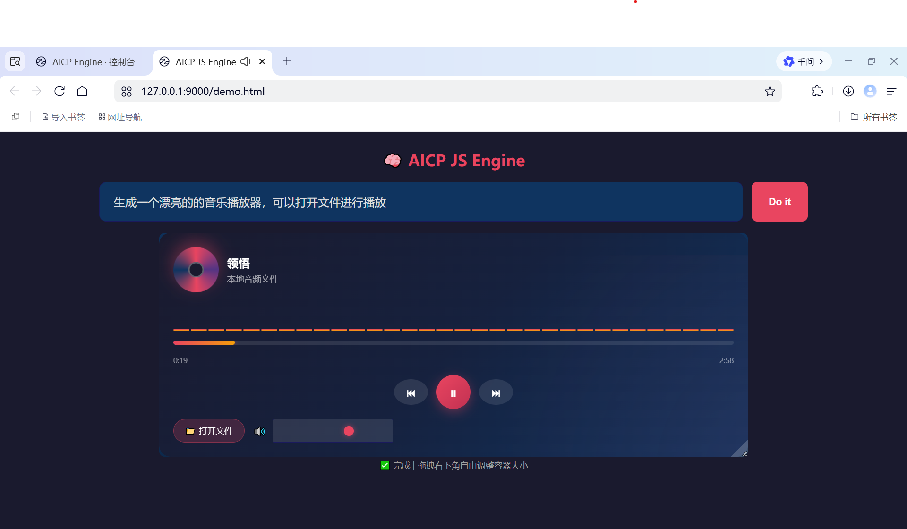

# AICP JS Engine
[中文](README_CN.md) | [English](README.md) | [开发文档](DEVELOP.md)

基于[AICP协议](https://github.com/woozheng/aicp)开发轻量级、纯前端的 JavaScript 智能体通信协议引擎，基于浏览器原生 ES Modules 实现。核心思路是：**用户说一句自然语言，LLM 自动生成 JavaScript 代码，引擎在沙箱中执行并实时渲染结果到 DOM 容器**。

整个流程**无需后端服务、无需打包构建，浏览器打开即用**。

支持 LLM 对话与代码执行双引擎、插件注册中心、消息信封路由、可配置重试迭代，画布/动画/可视化场景。

---
## 项目简介

AICP JS Engine 旨在提供一个极简的"自然语言 → 可视化产物"通路：

- **LLM 即编译器**：把用户意图实时编译成 JavaScript 代码
- **沙箱即运行时**：在受限环境中执行，注入容器与画布尺寸等全局变量
- **DOM 即画布**：直接渲染到指定容器，Canvas / DOM / Web Animation 全可用

[测试地址，点击可玩](https://live.biopoiesis.net/demo.html)
所有配置存入本地localstorage。纯静态网页，无后端。

## 项目展示

## 📸 AICP JS Engine 展示

### JS 生图
|  |  |
|:--:|:--:|
| 品牌宣传画 | 可视化演示 |

### JS 生游戏
|  |
|:--:|
| 交互游戏 |

### JS 生表单
|  |
|:--:|
| 简历表单 |

### JS 生一切
|  |  |
|:--:|:--:|
| Word 文档生成 | 音乐播放器 |

---

**JS 的能力边界，就是引擎的边界。**
---
## 快速启动

打开demo.html页面，根据提示填入LLM 参数、api-key

---

## License

[MIT](LICENSE) · Dvwoo